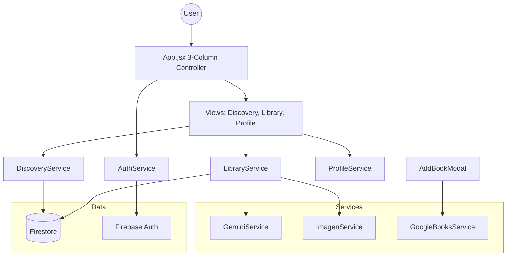

# Book-Loop: AI-Enhanced Book Swapping Platform


Book-Loop is a premium, AI-powered book swapping platform designed for modern bibliophiles. It leverages cutting-edge AI for metadata enrichment and cover generation, providing a seamless peer-to-peer discovery and trading experience.

## ✨ Key Features

-   **🤖 AI Enrichment**: Automated book summaries via Gemini 2.5 and custom cover generation via Imagen 4.0.
-   **🔍 Smart Discovery**: Real-time global feed with book recognition by title or ISBN using the Google Books API.
-   **🤝 P2P Swap System**: Robust peer-to-peer request handling with real-time notifications and a dedicated Trade Center.
-   **🔐 Secure Authentication**: Mandatory Google Sign-In gateway for secure data isolation and user identity.
-   **🎨 Premium SaaS UI**: Modern 3-column layout with a sleek Indigo theme, built for high engagement.

## 🛠️ Technical Stack

-   **Frontend**: React (v18), Tailwind CSS, Lucide React (Icons).
-   **Intelligence**: 
    -   `gemini-2.5-flash-preview-09-2025` (Summaries & Metadata)
    -   `imagen-4.0-generate-001` (Visual Enrichment)
-   **Backend**: Firebase (Authentication, Firestore, Hosting).
-   **External APIs**: Google Books API (Volumes v1).
-   **Build Tool**: Vite.

## 📁 System Architecture



## 🚀 Getting Started

### Prerequisites

-   Node.js (v18+)
-   Firebase CLI (`npm install -g firebase-tools`)
-   Google Cloud Project with Gemini and Imagen API access

### Installation

1.  Clone the repository:
    ```bash
    git clone https://github.com/your-repo/book-loop.git
    cd book-loop
    ```

2.  Install dependencies:
    ```bash
    npm install
    ```

3.  Configure environment:
    Create a `.env` file in the root with your Firebase and AI API credentials.

### Development Scripts

-   `npm run dev`: Start the Vite development server.
-   `npm run build`: Build the production bundle.
-   `npm run deploy:all`: Build and deploy to Firebase Hosting & Firestore.

## 🗺️ Roadmap Status (v0.6.0)

-   [x] **Phase 1**: Infrastructure & Google Auth Gateway
-   [x] **Phase 2**: Personal Library & AI Engine
-   [x] **Phase 3**: Global Discovery Feed
-   [x] **Phase 4**: Peer-to-Peer Swap System
-   [x] **Phase 5**: UI Renovation (Indigo SaaS)
-   [ ] **Post-Launch**: Skeleton loaders, CSV Export, Animation refinement

---
Created by Antigravity for Book-Loop Developers.
